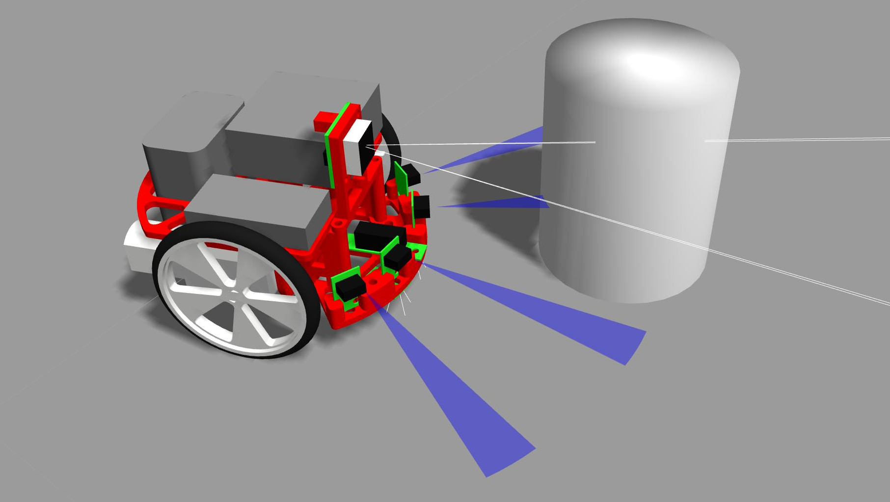
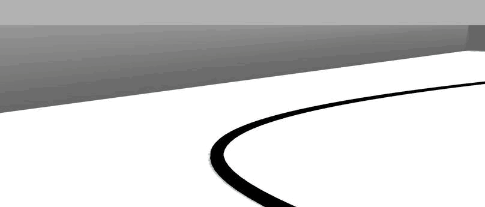

# PRisme ROS
This project aims at developing a comprehensive development environment for [Robopoly](http://robopoly.epfl.ch/)’s [PRisme](http://robopoly.epfl.ch/prisme) robotics platform using [ROS](http://www.ros.org), a standardised and modular robotics framework. 

We propose to decouple the high-level application software from the low-level and hardware-dependent firmware, and demonstrate its use with two interchangeable modules: a realistic simulation based on [Gazebo](http://gazebosim.org), and a software layer for the PRismino microcontroller.

<p align="center">
	
</p>

<!--
One might use this as a starting point for the simulation of a more advanced robot by modifying its physical description or by adding new sensors. It can also be considered as an educational tool for the study of robotics software and algorithms in applications such as localisation or path planing without the need to access the physical robot.

 and [printed base](https://github.com/Robopoly/Printed-base)
-->

## Scope
Software development for robotics can be particularly tricky, as the execution of the code (the application) highly depends on the proper functioning of the hardware (mechanics and electronics). 
Robotics simulations and frameworks aim at overcoming this problem by making robot software development less dependent on the actual physical hardware.

As such, the high-level application can already be designed and tested in simulation at early development stages, while the hardware and firmware can be independently developed. The seamless transition from the simulation to the physical robot is made possible by the ROS framework, which provides a way to develop software portions as computational units (*nodes*) that communicate with standard packets (*messages*) and can be run and tested independently from each other (see [this](http://wiki.ros.org/ROS/Introduction) for a comprehensive introduction).

## Main features
Five ROS packages make up the core of this project:

* `prisme_description`: the physical description of the robot, including 3D models, instantiations of sensors and the Rviz launcher
* `prisme_command`: the high-level application nodes, written in `C++` or `Python`, and running in a Linux environment 
* `prisme_gazebo`: the simulation setup, including maps and launchers for a variety of scenarios
* `prisme_firmware`: the low-level firmware layer running on the embedded microcontroller
* `prisme_control`: the controller for the differential drive

### Simulation

Currently implemented sensors include infra-red (IR) range sensors, IR light sensors, linear camera, IMU and encoders.
Simulation realism is improved by using real mass and inertia values for the 3D model and by adding a realistic gaussian noise to all sensors. 
Simulation performance is improved by simultaneously using two different types of 3D models: a visual mesh corresponding to the physical robot's appearance, and a simplified collision model used by Gazebo physics engine.

### Firmware
The microcontroller and the high-level computational unit communicate through a Serial interface, either over a wire or over Bluetooth. 
Thus, testing can be performed by running the application on a standalone computer, sending the motor commands or receiving the sensor inputs using a Bluetooth module. 
For deployment, an embedded single board computer, such as a Raspberry Pi, can perform the computationally-intensive tasks and communicate with the hardware interface using a more robust wired Serial.

## Installation
First of all, ensure that [ROS Jade](http://wiki.ros.org/jade/Installation) as well as the corresponding `gazebo-5` and `ros_control` packages are installed.

Then clone this repo in your catkin source directory and build it:
```
$ mkdir -p ~/catkin_ws/src
$ cd ~/catkin_ws/src
$ catkin_init_workspace
$ git clone https://github.com/Skydes/PRisme-Sim.git
$ cd ~/catkin_ws
$ catkin make
```

For every new terminal window, do not forget to source the setup file:
```
$ source ~/catkin_sw/devel/setup.bash
```

## Usage
The simulation components are run as separate ROS nodes that rely on each other. Each of them is started by running the `.launch` file of the corresponding package in a new terminal window:
```
$ roslaunch prisme_gazebo prisme_line.launch
$ roslaunch prisme_control prisme_control.launch
$ roslaunch prisme_description prisme_rviz.launch
$ rosrun prisme_command line_follower.py
```

One can alternatively create a [global launcher](http://wiki.ros.org/roslaunch/XML) that will take care of starting the individual nodes and that can be run this way:
```
$ roslaunch prisme_command line.launch
```

## Exemples of applications
A new high-level application node can be written (in Python for instance) and added to the `prisme_command/src` directory. It can read sensor values by subscribing to topics that regularly publish messages and whose list can be obtained from `$ rostopic list`.

This project currently contains three application examples based on the PRisme 3D-printed [base](https://github.com/Robopoly/Printed-base):
* Line following using IR (light) sensors and a P controller
* Obstacle avoidance using IR (range) sensors and Braitenberg-like behaviour
* Environment mapping using IR sensors and the ROS `slam_gmapping` package

<p align="center">
	
</p>

## Customisation
It is easy to modify the 3D models or to add new sensors by [editing the `.urdf` and `.gazebo` files](http://gazebosim.org/tutorials?tut=ros_urdf&cat=connect_ros) in the `gazebo_description/urdf` directory.

New simulation cases can be created by adding `.world` files to the `prisme_gazebo/worlds` directory.

## What comes next
* A custom hardware simulated interface for `ros_control` that publishes noisy discrete odometry values for quadrature encoders.
* Tests on the real sensors to determine the actual Gaussian noise parameters.
* Examples of multi-robot simulations.
* Reinforcement learning using multiple simulation instances.

## Credits
This project was entirely developed by Paul-Edouard Sarlin.
Special thanks are addressed to:
* Karl Kangur, who created the PRisme kit, had first the idea of such a project, and provided with a good [starting point](https://github.com/Nurgak/Virtual-Robot-Challenge).
* Alessandro Settimi, for its realistic [Gazebo IMU sensor plugin](https://github.com/ros-simulation/gazebo_ros_pkgs/pull/363).
* Ricardo Téllez, for its draft of the [Gazebo light sensor plugin](http://www.theconstructsim.com/create-a-ros-sensor-plugin-for-gazebo/).
